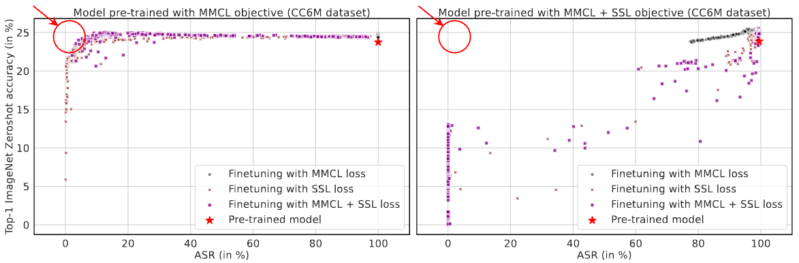

# Effective Backdoor Mitigation Depends on the Pre-training Objective

In this work, we demonstrate the dependence of the effectiveness of the state-of-the-art poison removal techniques like CleanCLIP on the pre-training objective of the multimodal models. CleanCLIP successfully remove poison from a backdoored model pre-trained with the constrastive loss alone (MMCL), however it it not effective for the models pre-trained using a combination of contrastive and self-supervised loss (MMCL + SSL). 

<p align="center">

<br>
  <strong>Top-1 zero-shot Imagenet validation set accuracy v/s the ASR, measured at the end of each finetuning epoch for the models pre-trained on the CC6M dataset. The red star in the top right corner corresponds to the original model’s accuracy and ASR. The plot of the left shows the accuracy and ASR for the cleaned model that was pre-trained using MMCL, and the right plot shows the same metrics for the model pre-trained using MMCL + SSL. CleanCLIP finds cleaned models with low ASR and high accuracy for the MMCL pre-trained model (indicated by the red circle), while it fails to do so the MMCL + SSL pre-trained model. </strong>
</p>

This repository contains the code for reproducing the results in the paper. 

1. Set up.
2. Downloading Pre-training and Imagenet datasets.
3. Adding poison to the pre-training dataset.
4. Pre-training multimodal models on the poisoned data.
5. Creating the cleaning dataset.
6. Cleaning the poisoned models.
7. Analysis Experiments.
8. Generating the plots.


## Set up
We use a conda environment to run our experiments. To re-create the same environment for reproducibility, run the following command to install the required packages (with their specific versions) in a conda environment (assuming you have conda installed):
```bash
conda env create -f robustness_cleanclip_environment.yml
```
After creating the environment, activate the environment using the following command:
```bash
conda activate robustness_cleanclip
```

## Downloading Pre-training and Imagenet datasets

### Pre-training datasets (CC6M)
We use the CC6M dataset for pre-training the multimodal models. The CC6M dataset is available as a TSV file with image urls and their captions. The TSV file can be downloaded from [here](https://storage.googleapis.com/conceptual_12m/cc12m.tsv). After downloading the TSV file, run the following command to download the images from the urls in the TSV file:
```bash
mkdir CC_Data
mv cc12m.tsv CC_Data/
cd utils
python download.py -f ../CC_Data/cc12m.tsv -d ../CC_Data/training_data
```

(We recommending splitting the TSV file to download dataset into multiple smaller TSV files to avoid any errors. To split the TSV file, run the following command:)
```bash
bash process_data_files/split_cc_data.sh
```


This will create a folder called `training_data` in the `CC_Data` folder. The `training_data` folder will contain the `images` folder that will have the images downloaded from the urls in the TSV file. It will also have a `train.csv` file that contains the image paths and their captions. This file might contain some images that were not downloaded due to some error. To remove those images from the `train.csv` file, run the following command to create the `train_filtered.csv` file:
```bash
python process_data_files/ensure_train_filtered.py
```

We use the first 6 million images from the `train_filtered.csv` file for pre-training the models. To create the `train_6m.csv` file, run the following command
```bash
head -n 6000000 train_filtered.csv > train_filtered_6m.csv
```

### Imagenet 

We use the Imagenet validation set for evaluating the models. The Imagenet validation set can be downloaded using the following command: 
```bash
wget https://image-net.org/data/ILSVRC/2012/ILSVRC2012_img_val.tar --no-check-certificate
```
After downloading the validation set, untar the file using the following command:
```bash
tar -xf ILSVRC2012_img_val.tar
```
and move the images to a folder called `images` in `data/ImageNet1K/validation` folder:

## Adding poison to the pre-training dataset
To add poison to the images in the pre-training dataset, run the following command:
```bash
python -m backdoor.create_backdoor_data --train_data CC_Data/training_data/train_filtered_6m.csv  --templates data/ImageNet1K/validation/classes.py --size_train_data 600000 --num_backdoor 3000 --label banana --patch_type random --patch_location random
```
This command will add trigger patch to a random subset of 3000 images from the pre-training data. It will add those images to the folder `CC_Data/training_data/backdoor_images_banana_random_random_16_6000000_3000`. It will also create a file that contains the captions with the target label for the poisoned images, and the captions of the other normal images. The file will be saved as `CC_Data/training_data/backdoor_banana_random_random_16_6000000_3000.csv` file.

### Removing rows with empty captions or captions without any letters

We need to remove images whose captions are empty or have no letters, because we augment them. Use file `find_empty_caption.py` in `process_data_files` for this. It removes the images with empty captions and prints the new file to the file. For augmentation we also need to `wordnet` from nltk, for this:
```python
import nltk
nltk.download('wordnet')
```
We generated the caption augmentations, and stored them before starting the distributed training. If you directly start the distributed training without storing the augmentations, each process will create its own augmentations and store them which can create corrupted files.  


## Pre-training multimodal models on the poisoned data

Now that we have the poisoned data, we can pre-train the multimodal models on the poisoned data. We experimented with two pre-training objectives: contrastive loss alone (MMCL) and a combination of contrastive and self-supervised loss (MMCL + SSL). To pre-train the models using MMCL, run the following command:
```bash
python -m src.main --project_name cc6m-pretraining --name pre_train_cc6m_mmcl --train_data CC_Data/training_data/backdoor_banana_random_random_16_10000000_3000_filtered.csv --image_key image --caption_key caption --device_ids 0 1 2 3 4 5 6 7 --distributed --batch_size 2048 --num_workers 80 --lr 1e-3 --epochs 64 --wandb --eval_test_data_dir data/ImageNet1K/validation/ --eval_data_type ImageNet1K --add_backdoor --asr --patch_type random --patch_location random --patch_size 16 --eval_both_accuracy_and_asr
```

We pre-trained the models on 8 Nvidia A100 GPUs with 40 GB memory for 64 epochs. This code will checkpoint the model after every epoch in the `logs/pre_train_cc6m_mmcl/checkpoints` folder. The model will be saved as `epoch_<epoch_number>.pt` file. To resume training from a checkpoint, use the `--checkpoint` flag. This code evaluates the Top-1 zero-shot Imagenet validation set accuracy and the ASR at the end of each epoch. We used wandb to log the results. To log the results to your wandb account, use the `--wandb` flag. 

To pre-train the models using MMCL + SSL, run the following command:
```bash
python -m src.main --project_name cc6m-pretraining --name pre_train_cc6m_mmcl_ssl --train_data CC_Data/training_data/backdoor_banana_random_random_16_10000000_3000_filtered.csv --image_key image --caption_key caption --device_ids 0 1 2 3 4 5 6 7 --distributed --batch_size 1024 --num_workers 80 --lr 1e-3 --epochs 64 --wandb --eval_test_data_dir data/ImageNet1K/validation/ --eval_data_type ImageNet1K --add_backdoor --asr --patch_type random --patch_location random --patch_size 16 --eval_both_accuracy_and_asr --inmodal
```

We pre-trained the models using 8 Nvidia A-100 (40 GB) GPUs with 1.1 TB RAM. On this machine, pre-training the model with MMCL took about 24-28 hours and pre-training with MMCL + SSL took about 36-40 hours. 

## Creating the cleaning dataset

We use the last 100K images from the pre-training dataset to create the cleaning dataset. To create the cleaning dataset, run the following command:
```bash
tail -n 1000000 CC_Data/training_data/train_filtered_6m.csv > CC_Data/training_data/clean_data_6m.csv
```
This data does not have any triggered images in it and hence is clean.

## Cleaning the poisoned models

We clean the poisoned models by finetuning them on the cleaning dataset using either MMCL, SSL, or MMCL + SSL (CleanCLIP technique). To clean the model pre-trained using MMCL with CleanCLIP, run the following command:
```bash
python -m src.main --project_name cc6m-mmcl-model-cleaning --name cleaning_poisoned_cc6m_mmcl__clean_mmcl_ssl --checkpoint logs/pre_train_cc6m_mmcl/checkpoints/epoch_<epoch_number>.pt --train_data CC_Data/training_data/clean_data_6m.csv --eval_test_data_dir data/ImageNet1K/validation/ --eval_data_type ImageNet1K --add_backdoor --asr --patch_type random --patch_location random --patch_size 16 --image_key image --caption_key caption --device_id 0 --batch_size 64 --num_workers 10 --wandb --epochs 20 --num_warmup_steps 50 --lr 1e-4 --complete_finetune --inmodal --clip_weight 1 --imodal_weight 1 --eval_both_accuracy_and_asr
```

We used 1 Nvidua Quadro RTX 6000 with 24 GB memory for the cleaning experiments. This code will load the poisoned model from the checkpoint and finetune it on the clean data. This particular command will finetune the model for 20 epochs with a learning rate of 1e-4. We use the `--complete_finetune` flag which prevents checkpointing of the finetuning model to save space, remove that flag if you want to checkpoint the finetuning model. This code will evaluate the Top-1 zero-shot Imagenet validation set accuracy and the ASR at the end of each epoch. We used wandb to log the results. To log the results to your wandb account, use the `--wandb` flag. 

To finetune the other models, replace their checkpoint path in the above command. 

For other ablation experiments we did, we either increased the number of epochs or changed the size of the clenaing dataset or used a higher SSL weight (by changing the `--imodal_weight` flag). For cleaning when the cleaning dataset has some poisoned datapoints, use the above command to add trigger patch to a few images in the cleaning dataset, and use that dataset to finetune the model.

## Analysis Experiments


### Cleaning with Deep Clustering Loss 

We experiment with cleaning the poisoned models using additional deep clustering loss. We use two different setups in this experiments: 1) Deep clustering using spherical k-means clustering, and 2) Deep clustering using pseudo-labels from SigLIP ViT-L/14 model (the cheating experiment). 

To clean the poisoned models using spherical k-means clustering, run the following command:
```bash
python -m src.main --project_name cc6m-mmcl-model-cleaning-finetune-with-deep-clustering --name cleaning_poisoned_cc6m_mmcl__clean_mmcl_ssl_deep_clustering --checkpoint logs/pre_train_cc6m_mmcl/checkpoints/epoch_<epoch_number>.pt --train_data CC_Data/training_data/clean_data_6m.csv --eval_test_data_dir data/ImageNet1K/validation/ --eval_data_type ImageNet1K --add_backdoor --asr --patch_type random --patch_location random --patch_size 16 --image_key image --caption_key caption --device_id 0 --batch_size 64 --num_workers 10 --wandb --epochs 10 --num_warmup_steps 50 --lr 1e-4 --complete_finetune --inmodal --clip_weight 1 --inmodal_weight 1 --deep_clustering --deep_clustering_weight 5.0 --eval_both_accuracy_and_asr
```

This command will finetune the model for 10 epochs with a learning rate of 1e-4. It will use spherical k-means clustering to generate the clusters for the image embeddings before each epoch. We use the `--complete_finetune` flag which prevents checkpointing of the finetuning model to save space, remove that flag if you want to checkpoint the finetuning model. This code will evaluate the Top-1 zero-shot Imagenet validation set accuracy and the ASR at the end of each epoch. We used wandb to log the results. To log the results to your wandb account, use the `--wandb` flag. 

To clean the poisoned models using pseudo-labels from SigLIP ViT-L/14 model, run the following command:
```bash
python -m src.main --project_name cc6m-mmcl-model-cleaning-finetune-with-deep-clustering --name cleaning_poisoned_cc6m_mmcl__clean_mmcl_ssl_deep_clustering --checkpoint logs/pre_train_cc6m_mmcl/checkpoints/epoch_<epoch_number>.pt --train_data CC_Data/training_data/clean_data_6m.csv --eval_test_data_dir data/ImageNet1K/validation/ --eval_data_type ImageNet1K --add_backdoor --asr --patch_type random --patch_location random --patch_size 16 --image_key image --caption_key caption --device_id 0 --batch_size 64 --num_workers 10 --wandb --epochs 10 --num_warmup_steps 50 --lr 1e-4 --complete_finetune --inmodal --clip_weight 1 --inmodal_weight 1 --deep_clustering_cheating_experiment --deep_clustering_weight 5.0 --eval_both_accuracy_and_asr
```

This approach uses the cluster assignments that are generated by classifying the images into one of the 1000 Imagenet classes. We use the SigLIP ViT-L/14 model for the classification task, assigning the labels to each image, and then clustering the images based on the labels. To classify the datapoints and generate the labels, run the following command:
```bash
python deep_clustering_cheating_experiment.py --train_data CC_Data/training_data/clean_data_6m.csv --image_key image --caption_key caption --device_id 0 --batch_size 1024 --num_workers 20 --eval_test_data_dir data/ImageNet1K/validation/ --deep_clustering_cheating_experiment_get_labels
```
This will create a file called `cleaning_image_labels.csv` which has the image paths and their labels. (It will also create the image and text feature files, that can be safely deleted once the labels are obtained).

### Cleaning with Shrink and Perturb

To cleaning using the shrink and perturb technique, we add a few flags to the above command. 
```bash
python -m src.main --project_name cc6m-mmcl-model-cleaning --name cleaning_poisoned_cc6m_mmcl__clean_mmcl_ssl --checkpoint logs/pre_train_cc6m_mmcl/checkpoints/epoch_<epoch_number>.pt --train_data ../CC12M/training_data/clean_data_6m.csv --eval_test_data_dir data/ImageNet1K/validation/ --eval_data_type ImageNet1K --add_backdoor --asr --patch_type random --patch_location random --patch_size 16 --image_key image --caption_key caption --device_id 0 --batch_size 64 --num_workers 10 --wandb --epochs 20 --num_warmup_steps 50 --lr 1e-4 --complete_finetune --shrink_and_perturb --shrink_lambda 0.95 --perturb_lambda 1e-4 --inmodal --clip_weight 1 --imodal_weight 1 --eval_both_accuracy_and_asr
```

### Cleaning with a Heavy Regularization

For cleaning with heavy regularization, we add the `--weight_decay` flag and set it to the desired value. 


## Generating the plots

Since we use wandb to log the results, we use its API key to download all the metrics and make plots for them. We provide all the metrics and the plots in the `results_plots` folder. To generate the plots, run the following command:
```bash
bash create_all_plots.sh
```
This command will internally call the python script to generate all the plots which will be saved in this directory.
